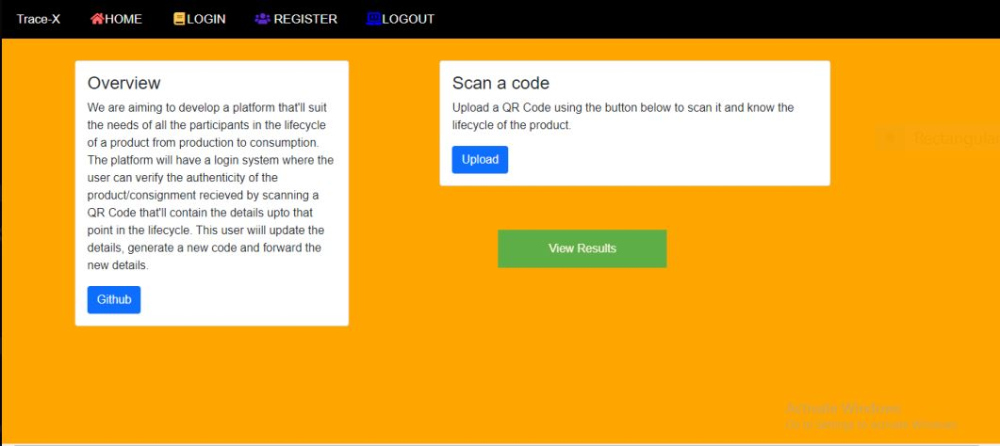

# HaXplore 2.0 - Submission Report Format

This is the official code repository for HAXPLORE2.0. This _WEB APP_ was developed during HaXplore 2.0, 
the online hackathon conducted by Codefest, the annual departmental fest of Computer Science department, IIT BHU Varanasi.

### _HAXPLORE2.0_

* _Shravan Kumar Verma_
* _Ratnesh Kumar Verma_
* _Shikher Sinha_
* _Karandeep Singh_

#### _TraceX_

#### Overview

_The idea was selected from the AWS track. We are aiming to develop a platform that'll suit the needs of all the participants in the lifecycle of a product from production to consumption. The platform will have a login system where the user can verify the authenticity of the product/consignment recieved by scanning a QR Code that'll contain the details upto that point in the lifecycle. This user wiill update the details, generate a new code and forward the new details._

#### Technology used

_HTML, CSS, JavaScript, Bootstrap, Node.js, Express.js, EJS View engine, MySQL, Git_

#### Screenshots/Demo Video

_***_

[Watch the video](https://drive.google.com/file/d/1B7-dyxQjNl4r3VKpr0XRxSO-NVbr4S23/view?ts=60605817)

#### Usage

_Users can scan QR Codes from the scanner on the first page by uploading images of QR Codes. A JSON file is returned which contains the details about the product from its inception, upto that point in the supply chain. Nodes in supply chain which aren't end users can also update the QR Codes and add new information to it using the edit page._

#### Tracks used
Amazon Web Services Track.

_You were given several tracks to choose from in the problem statement. Tell which one did you choose and how does your
application follow that track._

#### AWS Services Used

_Write in brief about how you used AWS service to improve your application._

---

